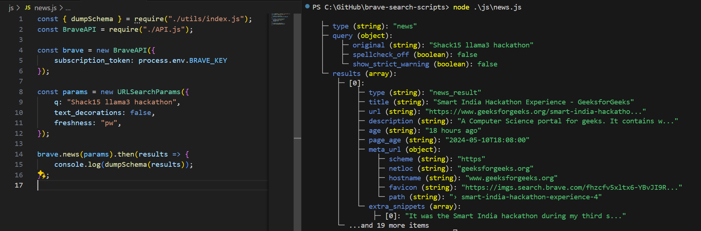

# brave-search-scripts
Examples to get you started with the Brave Search API

Sign up for a free API plan at [brave.com/search/api/](https://brave.com/search/api/).

The JavaScript (for nodejs) examples include a helper function called `dumpSchema` which will give quick insights into the structure of API responses.

Warning: This is a very primitive utility for now. It does not convey information regarding rate limits (available in response headers), handle failure well, etc. It is not intended for production use, but should be perfect for somebody just wanting to hack on the API a bit 😀